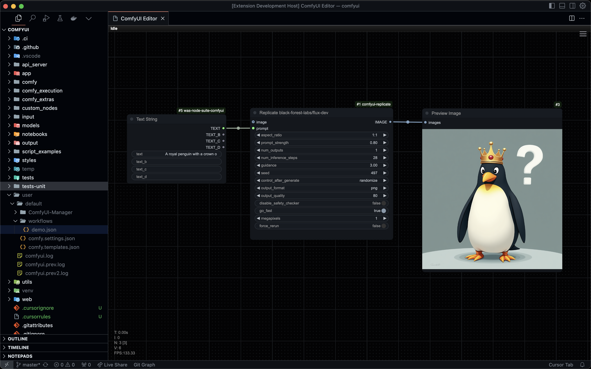

# Code ComfyUI

Interact with ComfyUI directly within your code editor.

## Who is this for?

Are you a developer or technical artist who works with both ComfyUI and code? Tired of constantly switching between windows – your code editor, ComfyUI interface, and terminal windows? This extension is for you!

Code ComfyUI brings your creative and technical workflows together in one place. Keep working in the comfort of your favorite code editor while having instant access to ComfyUI right there in a panel. No more context switching, no more window juggling – just seamless integration of your AI art generation and development workflows.

## Features

- 🎨 Interact with ComfyUI directly in your code editor (VS Code, Cursor, Theia, etc.)

## Requirements

- ComfyUI running locally on port 8188

## Installation

1. Install the extension from the VS Code / Cursor / Other Extension Marketplace

## Usage

1. Start your local ComfyUI server
2. Open your code editor
3. Use the Command Palette to run "Open ComfyUI Editor"
4. The ComfyUI interface will open in a new editor panel

## Release Notes

See [CHANGELOG.md](CHANGELOG.md) for detailed release notes.

## Contributing

Found a bug or want to contribute? Visit our [GitHub repository](https://github.com/piiq/code-comfyui).

## License

This extension is licensed under the MIT License.
